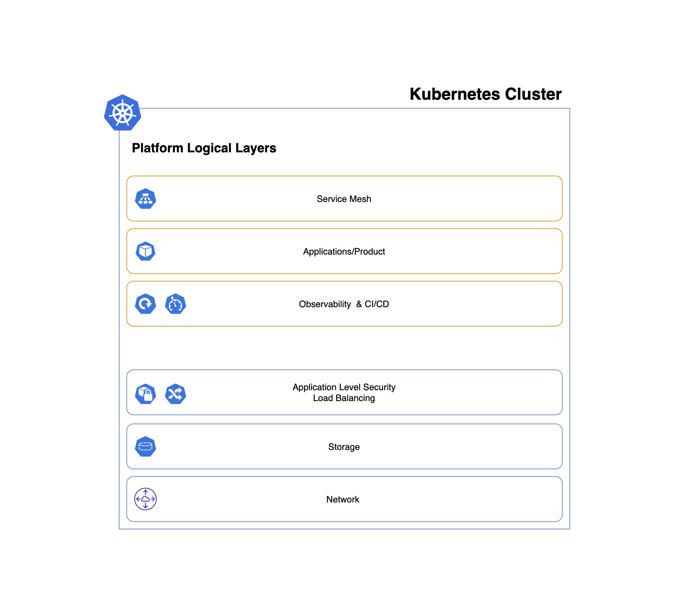

# Work in progress

This repository simulates an imaginary startup's platform, fully based on Kubernetes and cloud-native applications.

The porpuse of this repository is to provide a guideline to whoever wants to build a platform based on Kubernetes.

What is shown here is obviously not *the only* way to build your environments. Albeit, I do think that as a general approach the methodologies and tools implemented here, are a good start/best practice.

### Assumptions

myStartup:

* is using github.com to host the products & platform code.
* wants Kubernetes/GKE as base infrastructure layer.
* wants a fully secure, automated and reliable platform.

### Requirements:

- Kubernetes Cluster 1.16+
- Helm v3.0.0+

### Platform diagram (WIP):

### Installation (WIP):

--

### Concepts (WIP):

Infrastructure:

Development process:

Observability stack:
