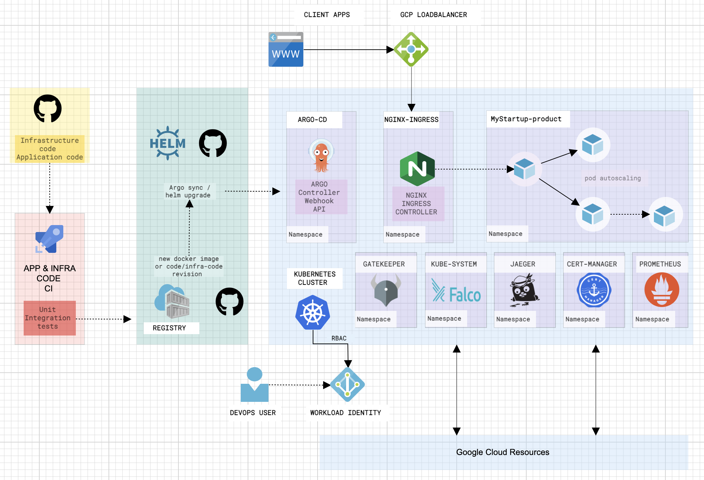

This repository simulates an imaginary startup platform, fully based on Kubernetes and cloud-native applications.

The porpuse of this repository is to provide a guideline to whoever is starting to build their own platform and wants some suggestion.

### Assumptions

myStartup:

* is using github.com to host the products & platform code.
* has Kubernetes as base infrastructure layer.
* want a fully secure, automated and reliable platform.

### myStartup Platform - Logical Layers (WIP)

